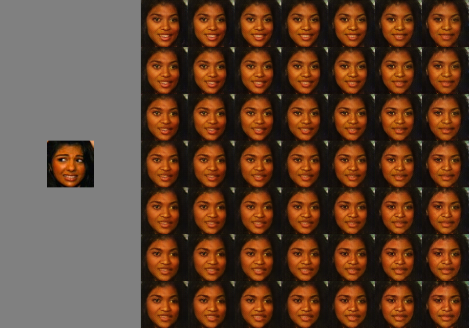
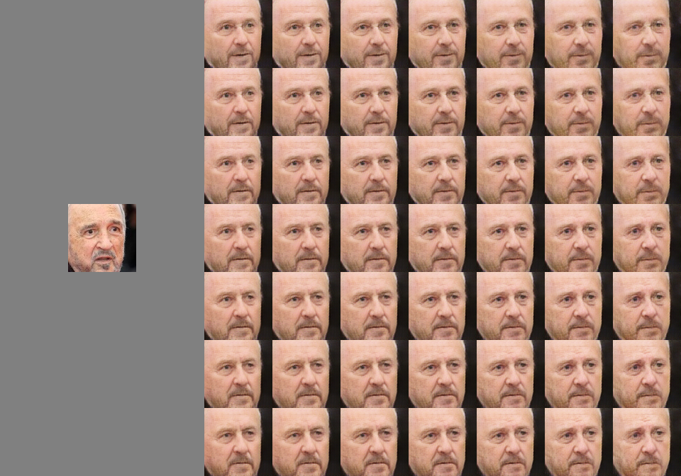
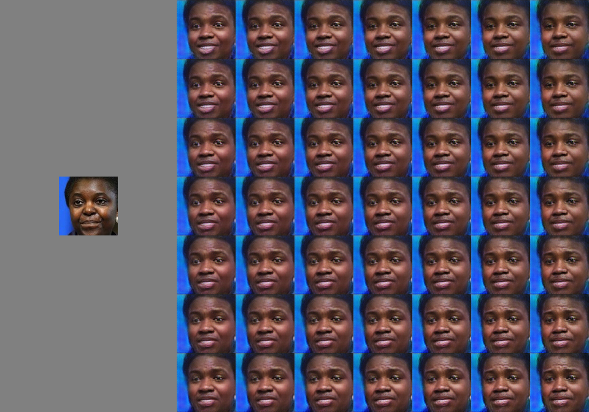
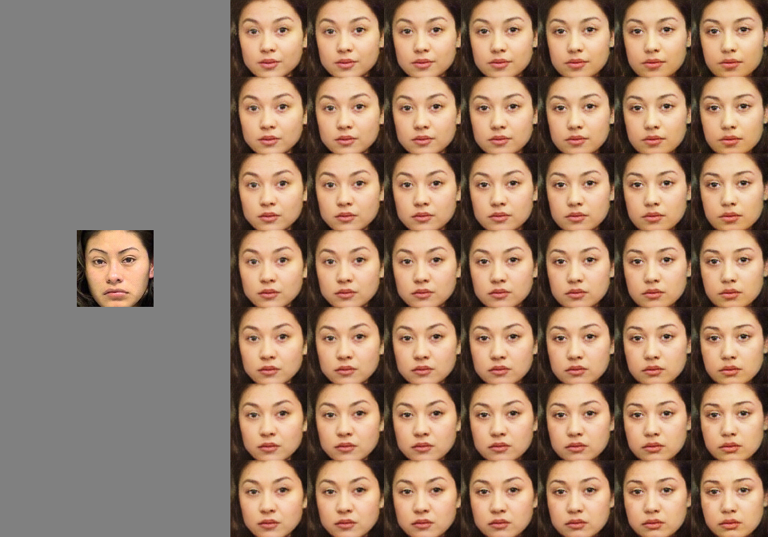
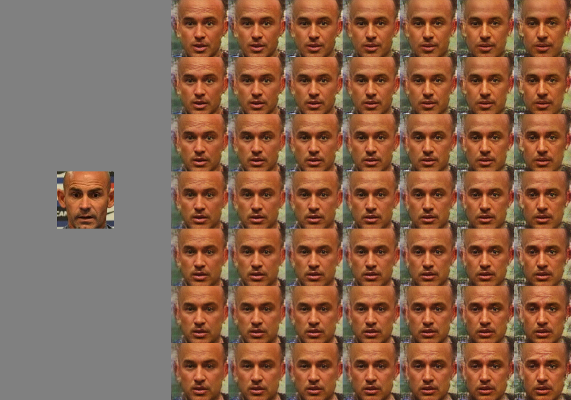
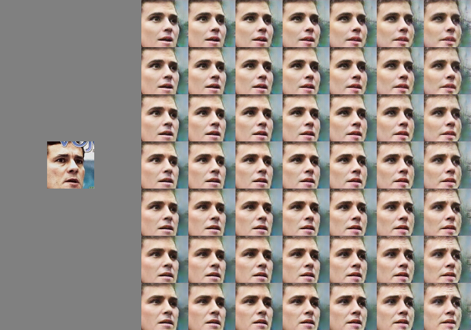

# Facial  Expression  Editing  CAAE

TensorFlow implementation of a Conditional Adversarial Autoencoder (CAAE) for facial expression editing with continuous emotion labels. We use the model to manipulate facial expressions in facial images according to continuous two-dimensional emotion labels: One dimension represents an emotion’s valence, the other represents its degree of arousal. 
The model was presented in the paper  

*Lindt, A., Barros, P., Siqueira, H. and Wermter, S., 2019, May. Facial expression editing with continuous emotion labels. In 14th IEEE International Conference on Automatic Face & Gesture Recognition (FG 2019) (pp. 1-8). IEEE.*

A pre-print version of the paper can be found [here](https://arxiv.org/abs/2006.12210).

## Model Structure 

The model consists of an autoencoder structure (i.e. encoder and decoder network) combined with two discriminator networks. All networks are trained in parralel.

## Training the Model

### Requirements
#### Conda Enviroment
The conda environment is saved in 

#### Data
We trained the model on the [affectnet database](http://mohammadmahoor.com/affectnet/). The images used for training and validation need to be saved in `./data/train` and `./data/validation` respectively.

#### VGG Face Model
The activations of several layers of a pre-trained VGG face model are incorporated in our model's loss function. Therefore, the VGG face model needs to be downloaded and saved to `./utils/vgg-face.mat`. The file `vgg-face.mat` is provided on [this website](https://www.vlfeat.org/matconvnet/pretrained/) in the *Face Recognition* section.

### Run
To train the model, simply adjust the hyperparameters in the config file `config.py` and run `python3 main.py`. 

## Testing the Model
We include two experiments 

## Results

Following, we provide several examples of images generated by our model. The graphics display the input image on the left side next to the output images created by our model for 49 different 2-dimensional emotion labels from high arousal(left) to low arousal(right) and from positive valence(top) to negative valence(bottom). This 2-dimensional representation of human emotion is know as the *Circumplexmodel of Affect* and was introduced by Russell (see the [original paper](https://psycnet.apa.org/record/1981-25062-001)). 

## Contact 

- Alexandra Lindt (alexandra.lindt@student.uva.nl)
- Pablo Barros (pablo.alvesdebarros@iit.it)
